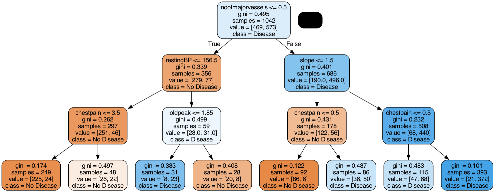
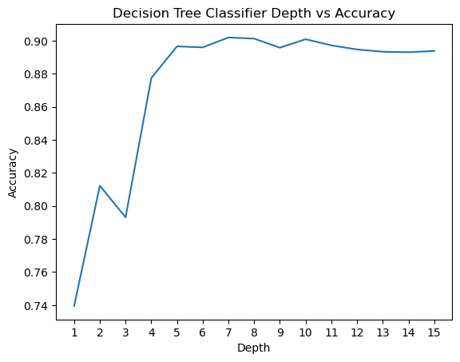
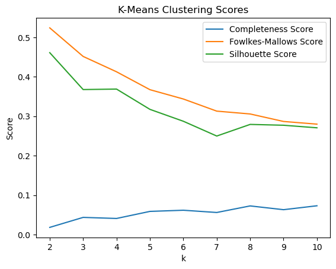
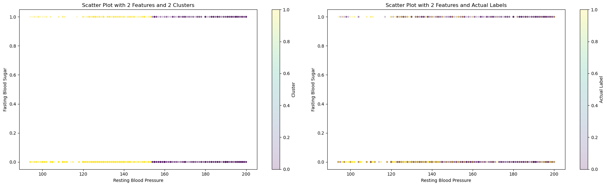
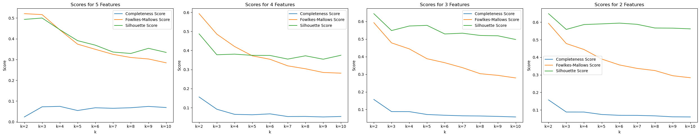

# Final Report

## Introduction

Cardiovascular disease (CVD), especially coronary heart disease (CHD), accounts for a major portion of global mortality [^1]. This has led to scientists collecting vast amount of data related to heart-disease and other conditions. With this data available, machine learning algorithms can better predict patients who are developing various kinds of diseases ranging from Diabetes to CVD [^2]. Research into which supervised learning techniques are best for CVD prediction is still ongoing into 2024 [^4], but we wish to also use this data to further develop unsupervised learning techniques since they can help us predict the disease without any labels.

We are exploring these two datasets:

1. [Cardiovascular Heart Disease Dataset](https://data.mendeley.com/datasets/dzz48mvjht/1) from the Mendeley database
2. [Heart Disease Cleveland Dataset](https://archive.ics.uci.edu/dataset/45/heart+disease) from the UC Irvine Machine Learning Repository

Both databases contains 12 features and a target variable specifying whether or not the patient was diagnosed with heart disease. They have 6 nominal values and 6 numeric values including age, blood pressure, and cholestrol levels.

## Problem Definition

We want to use machine learning models to predict if someone has cardiovascular disease from various health metrics. Most of the prior studies [^3] focused on supervised learning algorithms for making predictions; however, our project will focus on both unsupervised and supervised learning for more comprehensive results.

## Methods - Data Processing

### Data Cleaning

Some feature values, such as number of major vessels, are missing, so we decided to take the the mean from the rest of the column to fill in these missing values. We chose to use the ceiling of the mean specifically so we would not underestimate disease risk.

In addition, we combined the Mendeley and Cleveland datasets into one-- resulting in 1303 samples in total, 303 from the Cleveland dataset and 800 from the Mendeley dataset. This is a table of all the features and what they mean:

| Feature           | Values                | 
| :---------------- | :------:              | 
| age               |   years               | 
| gender            |   0: female, 1: male    | 
| chestpain         |   0: typical angina, 1: atypical angina, 2: non-anginal pain, 3: asymptomatic   | 
| restingBP         |  94–200 mm/HG         |
| serumcholestrol   |   85-602 mg/dl        | 
| fastingbloodsugar |   0, 1 > 120 mg/dl     | 
| restingrelectro   |  0: normal, 1: ST-T wave abnormality, 2: probable or definite left ventricular hypertrophy by Estes' criteria   | 
| maxheartrate      |  71 - 202    | 
| exerciseangia     |   0: no, 1: yes, whether exercise-induced angina is present   | 
| oldpeak           |   0-6.2, indicates exercise-induced ST-depression relative to the rest state   | 
| slope             |  1: upsloping, 2: flat, 3: downsloping, slope of the ST segment during peak exercise   | 
| noofmajorvessels  |  0-3   | 

For our target variable, 1 represents the presence of heart disease and 0 represents the absence of it. Using data from both datasets, we were able to construct a dataset that had an even number of patients from both target cases, with presence of heart disease being slightly overrepresented.

We also found that the patients represented in the Cleveland dataset are on average healthier than those in the Mendeley dataset (lower cholestrol, lower max heart rates, etc.), so combining the datasets makes an overall more representative dataset of different patient types. This will help prevent overfitting when we run our machine learning algorithms. It also simplifies the number of dataset we have to apply machine learning algorithms to.

### PCA Feature Reduction

We realized that using all 12 features caused some of our models to be achieving low scores. Thus, we decided to apply [PCA from Ski-Kit Learn](https://scikit-learn.org/dev/modules/generated/sklearn.decomposition.PCA.html) to reduce the dataset’s dimensionality while preserving as much information as possible. PCA helped identify the main patterns in the data by transforming the original features into new, uncorrelated components.

Result shows that the first few principal components capture the majority of the variance:

PC1 captures ~17.1% of the variance.
PC2 captures ~12.4%.
PC3, PC4, and PC5 each capture between 8-11%.
The rest of the components capture less but together, the components used explain around 95% of the dataset’s variance, meaning they retain most of the information in fewer dimensions.
Feature Influence:

PC1 is most influenced by PCT, noofmajorvessels, and slope, suggesting these features contribute significantly to the data’s overall structure.
PC2 focuses on chestpain, oldpeak, and age, capturing another aspect of the data.
PC3 and PC4 also capture unique feature combinations, with PC3 highlighting gender and serumcholestrol, and PC4 focusing on age and maxheartrate.

Visualization Insights: The 2D scatter plot of PC1 vs. PC2 shows how observations cluster or separate in this reduced space, which can reveal patterns or relationships not easily visible in the high-dimensional data.

We found that PCA effectively reduced the dataset’s complexity, retaining the main data structure and revealing which feature combinations contribute most to each principal component. This reduction will make further analysis or modeling more efficient and focused on the most informative aspects of the data.

### LDA Feature Reduction

During our midterm report, we only used PCA, which is an unsupervised feature reduction method. We wanted to see if using supervised feature reduction methods like LDA could provide better results. Thus, we decided to apply [LDA from Ski-Kit Learn](https://scikit-learn.org/dev/modules/generated/sklearn.discriminant_analysis.LinearDiscriminantAnalysis.html) to find out weights of features that make the best predictions.

Results shows the following weights 

1. slope                1.661987
2. noofmajorvessels     1.294616
3. chestpain            0.953406
4. fastingbloodsugar    0.855390
5. restingrelectro      0.738829
6. gender               0.578387
7. exerciseangia        0.538191
8. oldpeak              0.089231
9. restingBP            0.039594
10. age                  0.004841
11. maxheartrate         0.004204
12. serumcholestrol      0.001345

We also used this weight to test on our test dataset, where we achieved a 89% accuracy.

From LDA, we were able to select features that had higher weights. This reduction will make further analysis or modeling more efficient and focused on the most informative aspects of the data.

## Methods - Machine Learning Model

### Decision Tree Classifier (Supervised Learning)

We used [Decision Tree Classifier from Sci-Kit Learn](https://scikit-learn.org/dev/modules/generated/sklearn.tree.DecisionTreeClassifier.html) to train our model. Decision Tree Classifier was chosen because we could easily visualize in a tree what features help determine the predicted label as it creates a clear cutoffs for a binary outcome. For this model, we directly used all features after data cleaning to train our model. 

### Neural Network (Supervised Learning)

TBU

### SVM (Supervised Learning)

We utilized [Support Vector Machines (SVM) from Sci-Kit Learn](https://scikit-learn.org/1.5/modules/svm.html) to train our model. SVMs are particularly effective for binary classification tasks and are well-suited to handle high-dimensional data, making them a strong choice for predicting cardiovascular disease. For our project, we trained the SVM model on the cleaned dataset with all features included and then re-evaluated its performance after applying Principal Component Analysis (PCA) for dimensionality reduction. We selected the radial basis function (RBF) kernel to capture potential non-linear decision boundaries. To optimize the model, we conducted a grid search with cross-validation to tune the hyperparameters `C` (regularization strength) and `γ` (kernel coefficient). Additionally, we compared the SVM's performance on the original feature set with its performance on the reduced feature set to assess the impact of dimensionality reduction on key metrics such as accuracy, precision, and recall.

### KMeans (Unsupervised Learning)

We used [KMeans from Sci-Kit Learn](https://scikit-learn.org/1.5/modules/generated/sklearn.cluster.KMeans.html) to train our model. KMeans is able to quickly converge to k cluster centroids and find out the typical values of features for a group that have cardiovascular diseases, making results highly interpretable. For our project, we first tried using all features with KMeans, then later with partial features after PCA to evaluate if a better model can be trained. We also tried various values of K to determine the best outcome for a specific number of features. 

### GMM (Unsupervised Learning)

We used [GMM from Sci-Kit Learn](https://scikit-learn.org/dev/modules/generated/sklearn.mixture.GaussianMixture.html) to train our model. GMM is able to quickly converge to a given number of components and find out the typical values of features for a group that have cardiovascular diseases, making results highly interpretable. For our project, we first tried using all features with GMM, then later with partial features after PCA to evaluate if a better model can be trained. We also tried various values for the number of components to determine the best outcome for a specific number of features. 

### DBSCAN (Unsupervised Learning)

We used [DBSCAN from Sci-Kit Learn](https://scikit-learn.org/stable/modules/generated/sklearn.cluster.DBSCAN.html) 
to train our model. DBSCAN is able to group together closely connected points and separates loosely connected points, allowing for clustering patients that have shared risk factors. For our project, we first tried tuning the parameters necessary for performing DBSCAN. Currently, we are trying to optimize the DBSCAN performance accuracy.

## Results and Discussion

### Decision Tree Classifier

To fine-tune our decision tree classifier, we first decided on the best max depth. To better understand how a decision tree works with our data, we visualized what the tree looked like with a max depth of 3. This decision tree makes sense as values such as low chestpain would indicate that a patient does not have the diease.

Then, we incremented the depth all the way to 15, and found that a depth of 7 yielded the highest accuracy

We performed a similar experiment for Min Samples Leaf and found that a value of 2 yields the highest accuracy.

With these changes, we got the following score for decision tree. Accuracy: 0.9119, F1 Score: 0.9187, Precision: 0.9489, Recall: 0.8904. Almost all the scores were above 90%, which shows that decision tree is an effective model to use for this dataset.

Here's the confusion matrix for our predictions:

As we can see, there are more false negatives than false positives. This is why our recall score is lower and precision is higher. There is a trade-off between maximizing precision and recall, so we would favor this model if we were looking to ensure that patients who actually do not have heart disease do not get mislabeled.

For next steps, we can potentially feed in features extracted from PCA or another feature reduction method to see if a better model can be trained.

### Neural Network (Supervised Learning)

TBU

### SVM (Supervised Learning)

We utilized Support Vector Machines (SVM) to train our model, leveraging its effectiveness for binary classification tasks. We evaluated the performance of SVM on both the original feature set and a reduced feature set obtained using Linear Discriminant Analysis (LDA). The SVM model was tuned with hyperparameter optimization using GridSearchCV to achieve the best performance.

The hyperparameters tuned were:
- \( C \): Regularization parameter [0.1, 1, 10, 100]
- Kernel: ['linear', 'rbf']
- Gamma: ['scale', 'auto', 0.1, 1] (for 'rbf' kernel)

The model was trained and evaluated using 5-fold cross-validation for both original and LDA-reduced feature sets.

- **Original Features**:
  - Best Parameters: `{C: <value>, kernel: '<value>', gamma: <value>}`
  - Best Accuracy: `<value>`
- **LDA-Reduced Features**:
  - Best Parameters: `{C: <value>, kernel: '<value>', gamma: <value>}`
  - Best Accuracy: `<value>`
  
| Features          | Accuracy | F1 Score | Precision | Recall  |
|--------------------|----------|----------|-----------|---------|
| Original Features | `0.9080`| `0.9172`| `0.9236` | `0.9110`|
| LDA Features      | `0.9119`| `0.9215`| `0.9184` | `0.9247`|

Two plots illustrate the tuning results for both original and LDA-reduced features.

- **Original Features**:
  

- **LDA Features**:
  
  
These confusion matrices depict the classification results on the test set.

- **Original Features**:
  

- **LDA Features**:
  

This plot visualizes the decision boundary created by the SVM model for the LDA-reduced features.

- **Decision Boundary (LDA Features)**:
  

### KMeans

We first trained KMeans through all features and tested with the amount of cluster k. We were able to see that with k=2 clusters, the model performed the best. 

However, we wondered if the high dimensionality caused such a low high score. Thus, we decided to extract information from PCA to get a few features to use. From PCA, we are able to see that a few features appear frequently accross the tops of each PC, including
- Fasting Blood Sugar: Appears in PC1, PC6, PC7, PC9, PC10, and PC11.
- Resting BP: Appears in PC1, PC4, PC6, PC8, PC9, and PC11.
- Chest Pain: Appears in PC2, PC3, PC5, PC7, PC8, and PC11.
- Age: Appears in PC2, PC4, PC5, and PC7.
- Serum Cholesterol: Appears in PC1, PC3, PC9, and PC11.

We tested KMeans with the top 2, 3, 4, and 5 features, along with various amount of cluster k to see which one performs the best. 

In the image, we were able to see that with 2 features (Fasting Blood Sugar and Resting BP) and 2 clusters, we are able to achieve the best scores : Completeness Score=0.1569, Fowlkes-Mallows Score=0.5934, and Silhouette Score=0.6487.

On the left graph, we can see how KMeans cluster the dataset. On the right graph, we can see the actual labels of those data. Data in the middle are hard for KMeans to differentiate, which can explain why all three top scores are still rather low, especially the completeness score, where data points in each cluster are often mixed in the middle range.

Using 2 clusters in KMeans and the given labels, we attempted to see how well the model is able to seperate the labels too. This did not yield very strong results with a 57 percent accuracy obtained using KMeans model. For the future, we can try seperating on a redcuded feature set and try other methods to potentially increase the accuracy.

For next steps, we can potentially experiment with various feature pairs to produce a better KMeans model.

### GMM

We used a similar procedure for testing GMM as we did for KMeans. We first tried with different value of number of components in the Gaussian mixture and we found that that it worked best for number of components as 2, which is as expected. We got the following plot for GMM after applying PCA for getting reduced number of features.

For 2 features and 2 components, the scores obtained were:
Completeness Score = 0.12
Fowlkes-Mallows Score = 0.583
Silhouette Score = 0.637

Using 2 components in GMM and the given labels, we attempted to see how well the model is able to seperate the labels too. This did not yield very strong results with a 56 percent accuracy obtained using GMM model. For the future, we can try seperating on a reduced feature set and try other methods to potentially increase the accuracy.

### DBSCAN

We used specific methods to estimate the values for epsilon and minimum points. As there are more than 2 features within the dataset, the proper minimum points estimation is [double](https://medium.com/@tarammullin/dbscan-parameter-estimation-ff8330e3a3bd) the dimensionality of the dataset.

The optimal epsilon value can be determined from calculating the average distance between each point and its nearest k neighbors, where k = MinPts. From the [NearestNeighbors](https://scikit-learn.org/1.5/modules/neighbors.html) algorithm, plotting the average-k distances in ascending order results in the following graph:

We will select the point of the maximum curvature to estimate the epsilon value. From the graph, the best estimate for epsilon is 21. For the future, we can focus on utilizing the parameters to find the best clustering performance
for the DBSCAN algorithm.

### Next Steps

For data preprocessing, our next steps are to perform data augmentation so there are more patients represented with no cardiovascular disease. This will make our datset more balanced and prevent overfitting further. We also want to try a supervised method for feature reduction instead of PCA.

For supervised learning algorithms, we plan to run an ensemble learning algorithm such as the Random Forest classifier and see if that improves accuracy/precision/recall. We also want to run logistic regression as it's well suited for classification.

Lastly, we are lacking accuracy with our unsupervised learning algorithms, with both K-Means and GMM only producing slightly better classification than a random coin toss. Additionally, we are looking into completing the analysis for DBSCAN, since we have only selected 
the parameter values for the current midterm report. We are hoping to improve these through more research into unsupervised methods for classification tasks with a large number of features.

## Timeline

See [here](https://gtvault-my.sharepoint.com/:x:/g/personal/nmohanty8_gatech_edu/Ea0hvb17CY9PqYDmi1OoNPgBdbaerT9mzkF-UBq1l0d3eA?e=fmUT9p) for our Gantt Chart.

## Contributors

| Name      | Contribution                 |
| --------  | ---------------------------- |
| Suzan     | LDA                          |
| Natasha   | NN                           |
| Kalp      | NN, Logistic Regression      |
| Chih-Chun | LDA                          |
| Eric      | SVM                          |

## References
[^1]: S. Hossain et al., “Machine Learning Approach for predicting cardiovascular disease in Bangladesh: Evidence from a cross-sectional study in 2023 - BMC Cardiovascular Disorders,” BioMed Central, https://bmccardiovascdisord.biomedcentral.com/articles/10.1186/s12872-024-03883-2.

[^2]: A. Dinh, S. Miertschin, A. Young, and S. D. Mohanty, “A data-driven approach to predicting diabetes and cardiovascular disease with Machine Learning - BMC Medical Informatics and Decision making,” SpringerLink, https://link.springer.com/article/10.1186/s12911-019-0918-5/metrics.

[^3]: A. Javaid et al., “Medicine 2032: The Future of Cardiovascular Disease Prevention with Machine Learning and Digital Health Technology,” American Journal of Preventive Cardiology, vol. 12, p. 100379, Dec. 2022. doi:10.1016/j.ajpc.2022.100379.

[^4]: Ogunpola, A.; Saeed, F.; Basurra, S.; Albarrak, A.M.; Qasem, S.N. Machine Learning-Based Predictive Models for Detection of Cardiovascular Diseases. Diagnostics 2024, 14, 144. https://doi.org/10.3390/diagnostics14020144

[^5]: Palechor, Fabio Mendoza et al. “Cardiovascular Disease Analysis Using Supervised and Unsupervised Data Mining Techniques.” J. Softw. 12 (2017): 81-90.
